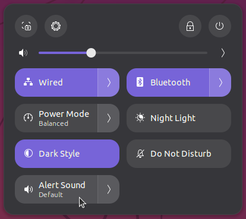
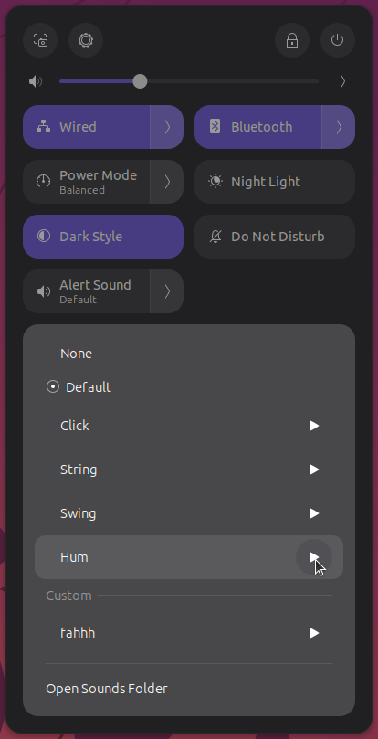

# Overview

GNOME Shell extension to select custom `.ogg`, `.oga`, or `.wav` files as system alert sound - directly from Quick Settings, no `sudo` required.

## Features

- Switch between built-in GNOME alert sounds from Quick Settings panel
- Add custom `.ogg`, `.oga`, or `.wav` files by dropping them in a dedicated folder
- Preview any sound before selecting it
- Changes take effect immediately - no restart needed

## Screenshots

*Alert Sound toggle in Quick Settings*

*Sound picker with built-in and custom sounds*

